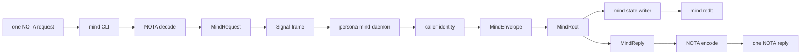
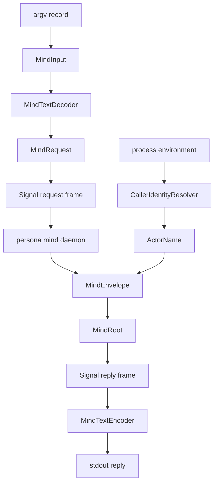
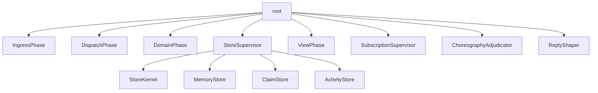
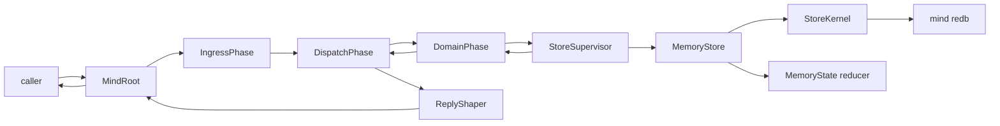
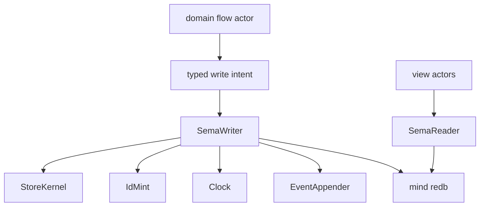
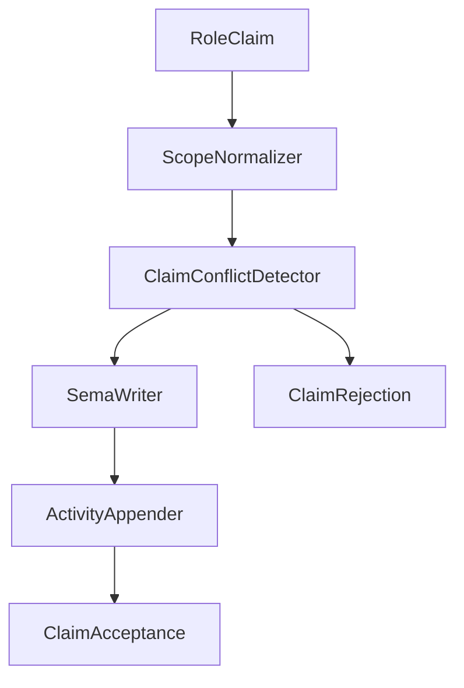
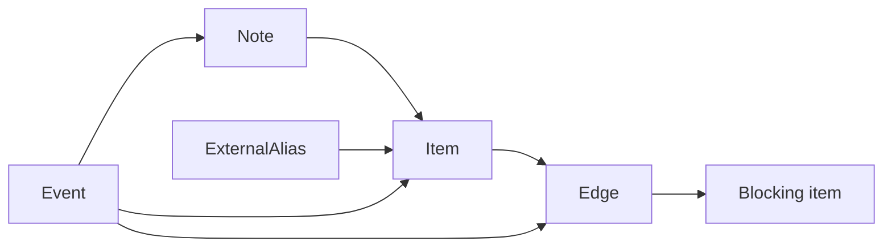

# persona-mind — architecture

*Central Kameo actor system for Persona coordination, work memory, and the
command-line mind.*

> Status: the crate has a real Kameo runtime, mind-local Sema tables for
> durable role claims, activity records, and a typed work-graph snapshot.
> Typed Thought/Relation graph records use `sema-engine` for Assert/Match and
> operation-log snapshots. Typed graph subscriptions register through
> `sema-engine` Subscribe and keep only Persona-specific filter rows locally;
> post-commit push delivery now enters the `SubscriptionSupervisor` actor path,
> while the external long-lived streaming surface remains future work. Older
> tables still use the same underlying `sema` kernel handle. The crate also has a Unix-socket
> Signal-frame daemon/client transport around `MindRoot`. The
> `mind` binary can run a daemon and submit NOTA role
> claim/release/handoff/observation, activity submission/query, and work-graph
> opening/note/link/status/alias/query requests through that daemon.

> **Scope.** "Sema" in this document is today's `sema` library (typed
> storage kernel). The eventual `Sema` is
> broader (universal medium for meaning); today's persona-mind is a
> realization step on the eventually-self-hosting stack, built rightly
> for the scope it serves now. See `~/primary/ESSENCE.md` §"Today and
> eventually — different things, different names".

---

## 0 · TL;DR

`persona-mind` owns Persona's central workspace state: role claims, handoffs,
activity, work items, notes, dependencies, decisions, aliases, event history,
and ready/blocked views. It replaces the lock-file orchestration model. Lock
files are not part of this implementation; they are a temporary workspace
coordination mechanism that will be retired when agents switch to `mind`. BEADS
entries may be imported as history/aliases, but BEADS is not a live backend.

All public operations enter through `signal-persona-mind` records. The
command-line surface is the `mind` binary: exactly one NOTA request record in,
exactly one NOTA reply record out. The binary is a thin client, not a second
command language. It decodes NOTA into `MindRequest`, resolves caller identity,
wraps the request in a Signal frame, sends that frame to a long-lived
`persona-mind` daemon, and prints the daemon's NOTA `MindReply`.

The daemon owns `MindRoot` for its process lifetime. Tests and early
scaffolding use `ActorRef<MindRoot>` directly; there is no separate in-process
runtime facade. Request phases that currently exist as trace witnesses become
real actors when they own state, IO, failure, identity, time, IDs, or
transaction ordering.



## 1 · Public Surface

The crate exposes:

| Surface | Purpose |
|---|---|
| `MindEnvelope` | Infrastructure-supplied caller identity plus one `MindRequest`. |
| `ActorRef<MindRoot>` | Direct Kameo root actor surface for in-process tests and daemon scaffolding. |
| `MindRootReply` | Typed reply plus actor trace witness. |
| `MemoryState` | Current in-memory work/memory reducer used behind the actor path. |
| `ClaimState` | Current in-memory claim reducer used by claim-scope tests. |
| `actors::ActorManifest` | Runtime topology witness. |
| `actors::ActorTrace` | Per-request path witness for architectural-truth tests. |
| `MindDaemonEndpoint` | Unix-socket endpoint value for the local daemon transport. |
| `MindFrameCodec` | Length-prefixed Signal frame codec used by client and daemon. |
| `MindClient` | Thin local client that attaches Signal auth, submits one request frame, and reads one reply frame. |
| `MindDaemon` | Bound one-shot daemon harness around `MindRoot`; reads actor identity from Signal auth before entering the root actor. |
| `MindCommand` | Process-boundary command parser for daemon mode and one NOTA request submission. |
| `MindTextRequest` / `MindTextReply` | Current NOTA projection for role coordination, activity, and work-graph request/reply records. |
| `mind` binary | Daemon-backed command-line mind for the implemented role-state slice. |

The public protocol is not defined here. `signal-persona-mind` owns the
request and reply records. `persona-mind` consumes those records and applies
state transitions.

## 2 · Command-line Mind

The command-line mind is a thin client boundary over a long-lived daemon. The
daemon owns the runtime path. The current crate has a Unix-socket daemon,
Signal-frame transport, and a NOTA projection for role coordination, activity,
and work-graph operations.

Command-line interfaces in this workspace interact with daemons. The
command-line mind is not a one-shot state owner and should not reopen that
decision.



Process-boundary types should be small and data-bearing:

| Type | Owns |
|---|---|
| `MindCommand` | argv, environment, exit rendering. |
| `MindTextRequest` | exactly-one-record rule for implemented request records. |
| `MindTextReply` | NOTA rendering for implemented reply records. |
| `MindClient` | caller identity as Signal auth plus request/reply exchange. |
| `MindDaemonEndpoint` | local daemon endpoint default and explicit override. |

No request payload mints authority. Actor identity, timestamps, event sequence,
operation IDs, and display IDs are infrastructure/store concerns.

## 3 · Runtime Topology

Current long-lived actors:



`ReplyShaper` shapes exactly one reply per request; it does not supervise
children. The name reflects verb-belongs-to-noun: it is a shaping verb on the
reply path, not a supervision relationship.

### ChoreographyAdjudicator (destination)

`ChoreographyAdjudicator` is a stateful child of `MindRoot` that owns the
channel-choreography decision plane. It holds:

- `policy: ChoreographyPolicy` — the live policy that decides grant/deny;
- a grant table keyed by `ChannelId` (`HashMap<ChannelId, ChannelGrant>`)
  carrying the active grants;
- an adjudication log of accepted/denied requests for audit and replay.

It handles the full choreography family — `AdjudicationRequest`,
`ChannelGrant`, `ChannelExtend`, `ChannelRetract`, `AdjudicationDeny`,
`ChannelList` — and routes `SubscriptionRetraction` requests by closing the
named subscription's stream and emitting the `SubscriptionRetracted` reply.
Both the retract request and the retracted reply are first-class per the
`signal_channel!` streaming grammar.

Status: destination. Today the dispatch routes choreography request variants
to `MindReply::MindRequestUnimplemented(NotInPrototypeScope)`. The
`ChoreographyAdjudicator` actor is the next implementation gate; the
trace test for choreography asserts the actor receives the message and
that no `unimplemented` fallback is hit.

### Subscription push delivery (destination)

The destination shape for typed graph subscription push delivery splits
`SubscriptionSupervisor` into three actors:

- **`SubscriptionManager`** — owns subscription metadata: subscription IDs,
  registration state, the durable filter row, last-acked delta cursor.
  Persists through `StoreKernel` to `thought_subscriptions` /
  `relation_subscriptions` in `mind.redb`.
- **`StreamingReplyHandler`** (one per live subscription) — owns the reply
  channel for that subscription, buffers post-commit deltas under the
  consumer's signalled demand, and emits the terminal
  `MindReply::SubscriptionRetracted` reply when the consumer's
  `MindRequest::SubscriptionRetraction` request closes the stream (or when
  the producer terminates the stream itself).
- **`SubscriptionDeltaPublisher`** — fires after each store commit; reads
  the committed delta, looks up matching subscriptions through
  `SubscriptionManager`, and hands typed delta records to the matching
  `StreamingReplyHandler`s.

Backpressure is consumer-driven: the consumer signals
`MindRequest::SubscriptionDemand(n)`; `StreamingReplyHandler` releases up
to `n` deltas and then waits. There is no unbounded
`SubscriptionSupervisor::events: Vec<_>` buffer in the destination shape.

Status: destination. Today `SubscriptionSupervisor` collects post-commit
deltas behind an in-actor buffer; the three-actor split with
consumer-driven demand and the typed retract/retracted close discipline
is transitional → destination.

Current request path for implemented memory/work operations:



`TraceNode` currently names both real Kameo actors and trace phases. The
manifest distinguishes them through residency. That is acceptable as a staging
tool, but stateful phases must graduate into real actors as implementation
lands.

| Trace phase | Graduation trigger |
|---|---|
| `NotaDecoder` | owns text diagnostics and parse failure. |
| `CallerIdentityResolver` | owns caller resolution and authority failure. |
| `ClaimFlow` / `ClaimConflictDetector` | owns conflict semantics. |
| `ActivityFlow` / `ActivityAppender` | owns store-stamped activity append. |
| `GraphFlow` / `GraphStore` | owns typed Thought/Relation append and query. |
| `SemaWriter` | owns write ordering and transaction failure. |
| `SemaReader` | owns read snapshots. |
| `IdMint` | owns stable/display ID collision state. |
| `Clock` | owns store-supplied time. |
| `EventAppender` | owns append-only event ordering. |

## 4 · State and Storage

Current implementation:

- `StoreSupervisor` supervises `StoreKernel`, `MemoryStore`, `ClaimStore`,
  `ActivityStore`, and `GraphStore`.
- `StoreKernel` is the only actor that opens and owns the `MindTables` handle
  over `mind.redb`.
- `StoreKernel` currently spawns on Tokio's shared worker pool via
  `supervise(...).spawn()`. The destination is a **dedicated OS thread**
  (Template 2 from `~/primary/skills/kameo.md` §"Blocking-plane templates"),
  because every kernel handler performs a synchronous redb transaction and
  running those on a shared worker stalls sibling actors. Switching to
  `supervise(...).spawn_in_thread()` on Kameo 0.20 keeps the redb file
  locked across daemon restart: Kameo signals "child closed" when the
  mailbox receiver is dropped, **before** the actor's `Self` value (which
  holds `MindTables` and the redb `Database`) is dropped. The next daemon's
  `bind()` then races the old OS thread and fails with `UnexpectedEof` or
  hangs on the second open. Deferral pending either a Kameo close hook
  that fires after `Self` is dropped, or an actor-owned close-then-confirm
  protocol.
- `MindTables` schema v7 owns claims, activities, slot cursors, the typed
  `memory_graph` snapshot table, typed graph subscription registration tables,
  and the `sema-engine` table registrations for typed Thought/Relation graph
  records.
- `ClaimStore` routes claim/release/handoff/observation work to `StoreKernel`,
  where `ClaimLedger` performs the Sema reads and writes.
- `ActivityStore` routes activity append/query work to `StoreKernel`, where
  `ActivityLedger` performs the Sema reads and writes.
- `MemoryStore` owns the private `MemoryState` reducer and commits accepted
  work/memory snapshots through `StoreKernel`.
- `GraphStore` routes `SubmitThought`, `SubmitRelation`, `QueryThoughts`,
  `QueryRelations`, `SubscribeThoughts`, and `SubscribeRelations` to
  `StoreKernel`, where `MindGraphLedger` writes typed `Thought`/`Relation`
  records through `sema-engine`, reads them through `sema-engine` Match
  queries, registers subscriptions through `sema-engine` Subscribe, and stores
  only Persona-specific subscription filters through the same `sema` kernel
  handle.
- `SubscriptionSupervisor` receives post-commit graph deltas from
  `sema-engine` subscription sinks and publishes typed
  `signal-persona-mind::SubscriptionEvent` records for matching durable
  filters. Thought filters are evaluated against the current relation snapshot
  through the store actor path; relation filters are evaluated directly. The
  in-actor delta buffer is transitional; the destination split into
  `SubscriptionManager` + `StreamingReplyHandler` + `SubscriptionDeltaPublisher`
  with consumer-driven demand lives in §3.
- Subscription close follows the `signal_channel!` streaming grammar:
  `Subscribe` opens the stream, the consumer sends a typed
  `Retract SubscriptionRetraction(SubscriptionId)` request to close,
  and the producer returns `MindReply::SubscriptionRetracted` as the
  final acknowledgement before the stream ends. Both the request-side
  retract verb and the reply-side acknowledgement are first-class. The
  `signal_channel!` macro emits a `closed_stream()` discriminant on the
  request enum from this pairing — that is the binding shape, not a
  transitional one.
- Work/memory mutations append typed `Event` values in the reducer, then
  replace the typed Sema graph snapshot before success replies are emitted.
- Queries read the loaded work graph through `MemoryStore` and produce typed
  `View` replies.
- Role claim, release, handoff, observation, activity submission, activity
  query, and first typed mind-graph create/query/subscription-registration
  operations are routed through the actor path.

Destination:



The durable store is one workspace-local `mind.redb` owned by
`persona-mind`. `sema-engine` owns the single `sema::Sema` handle used by
`MindTables`; migrated graph records use engine verbs, and unmigrated
component-local tables temporarily use `Engine::storage_kernel()` so the
process does not open two redb handles to the same file. The mind-specific
Sema layer and table declarations belong to `persona-mind` because mind owns
this state. There is no shared `persona-sema` layer for mind state. Other
components talk to mind through `signal-persona-mind`.

Recommended tables:

| Table | Purpose |
|---|---|
| `claims` | Active role claims and reasons. |
| `handoffs` | Pending/completed handoff records. |
| `activities` | Store-stamped role activity. |
| `activity_next_slot` | Next activity slot cursor; avoids scanning activities on every append. |
| `memory_graph` | Current typed graph snapshot for the first durable implementation wave. |
| `thoughts` | `sema-engine` registered family for append-only typed `Thought` records; IDs are compact three-letter values minted from the engine snapshot sequence. |
| `relations` | `sema-engine` registered family for append-only typed `Relation` records between thoughts; relation IDs use the same compact sequence policy but stay a distinct `RelationId` type. |
| `thought_subscriptions` | Durable Persona-specific `SubscribeThoughts` filters keyed by IDs minted from `sema-engine` subscription handles. |
| `relation_subscriptions` | Durable Persona-specific `SubscribeRelations` filters keyed by IDs minted from `sema-engine` subscription handles. |
| `items` | Work/memory/decision/question records. |
| `notes` | Notes attached to items. |
| `edges` | Dependencies and references. |
| `aliases` | Imported or external identifiers, including BEADS IDs. |
| `events` | Append-only state mutation history. |
| `meta` | schema version and store identity. |

The event log is the audit trail. Current-state tables and views are derived
state optimized for queries.

## 5 · Role Coordination

The first `mind` replacement for `tools/orchestrate` must implement:

| Operation | Required behavior |
|---|---|
| `RoleClaim` | normalize scopes, detect conflicts, commit accepted claims. |
| `RoleRelease` | release all scopes for the role. |
| `RoleHandoff` | verify exact source ownership, verify target compatibility, move ownership atomically. |
| `RoleObservation` | return typed role snapshot plus recent activity. |
| `ActivitySubmission` | append store-stamped activity; caller does not supply time. |
| `ActivityQuery` | read recent activity with typed filters. |



This replaces lock-file ownership. Do not add lock-file projections to
`persona-mind`; migration away from lock files is handled at the workspace
workflow boundary, not inside the mind implementation.

## 6 · Work and Memory Graph

The work graph is the typed replacement for BEADS as an active project memory
substrate. BEADS entries may be imported once as aliases or external
references; Persona should not grow a long-term BEADS bridge.

Implemented reducer requests:

- `Open`
- `AddNote`
- `Link`
- `ChangeStatus`
- `AddAlias`
- `Query`

Required graph invariants:

- Items have stable internal IDs and short display IDs.
- Dependencies are typed edges, not string fields.
- Notes are append-only records attached through events.
- Imported IDs become aliases or external references.
- Ready/blocked views derive from item status and dependency edges.
- Queries do not mutate state.



## 6.5 · Supervision-relation reception

The mind daemon answers the `signal-persona::SupervisionRequest` relation
from a canonical `SupervisionPhase` Kameo actor inside `MindRoot`'s tree.
The phase actor carries `component_name`, `component_kind`,
`supervision_protocol_version`, and the cached `ComponentHealth` pushed
from the domain plane. For domain operations whose behavior is not yet
built, `MindRoot` replies
`MindReply::MindRequestUnimplemented(NotInPrototypeScope)` — a typed
answer, not a panic. The channel-choreography family
(`AdjudicationRequest`, `ChannelGrant`, `ChannelExtend`,
`ChannelRetract`, `AdjudicationDeny`, `ChannelList`,
`SubscriptionRetraction`) routes to `ChoreographyAdjudicator` in the
destination shape; the current `Unimplemented(NotInPrototypeScope)` reply
is transitional and retires when the actor lands. The mind daemon reads
its `signal-persona::SpawnEnvelope` at startup, binds `mind.sock` at the
named mode, and proceeds.

## 7 · Boundaries

This repo owns:

- the `mind` CLI binary and process-boundary logic;
- Kameo runtime topology for the central mind;
- role claim/release/handoff/activity behavior;
- work/memory graph behavior;
- durable `mind.redb` ownership;
- mind-specific architectural-truth tests.

This repo does not own:

- `signal-persona-mind` contract records;
- router delivery or harness messaging;
- terminal transport, which belongs to `persona-terminal`;
- OS/window-manager observation;
- `sema` kernel internals;
- a shared database for other components;
- BEADS as a live backend.

## 8 · Constraints

- The `mind` CLI accepts exactly one NOTA request record and prints exactly one
  NOTA reply record.
- CLI constraint tests run the production `mind` binary through Nix.
- CLI constraint tests start a real daemon when the constraint requires
  runtime state.
- The `mind` CLI sends Signal frames to the long-lived `persona-mind` daemon;
  it does not own `MindRoot`.
- The `mind` CLI supports role claim/release/handoff/observation, activity
  submission/query, and work-graph opening/note/link/status/alias/query text
  records.
- `MindClient` sends one length-prefixed Signal request frame to the daemon and
  expects one length-prefixed Signal reply frame back.
- `MindClient` supplies caller identity through Signal auth, not through the
  request payload.
- `MindDaemon` routes request frames through `MindRoot`; it does not construct
  success replies without the actor path.
- `MindDaemon` rejects request frames that do not carry a recognized Signal
  auth proof.
- A missing daemon cannot produce a client reply.
- The daemon owns `MindRoot` for its process lifetime.
- The daemon owns `mind.redb`; the CLI never opens the database.
- `StoreKernel` is the only store actor that opens and owns the `MindTables`
  handle for `mind.redb`.
- `MemoryStore`, `ClaimStore`, and `ActivityStore` do not open separate
  database handles; they ask `StoreKernel`.
- Role claims, releases, handoffs, and observations read/write the mind-local
  Sema claims table in `mind.redb`.
- Activity submissions and queries read/write the mind-local Sema activities
  table in `mind.redb`.
- Work/memory writes replace the typed `memory_graph` snapshot in `mind.redb`
  before producing success replies.
- Typed graph thought/relation writes use `sema-engine` Assert on registered
  `thoughts` / `relations` record families before producing success replies.
- Typed graph IDs are compact sequence-derived tokens minted from the
  `sema-engine` snapshot sequence; they are not content hashes, timestamps,
  payload fields, or strings with embedded type prefixes.
- Typed graph ID continuity survives reopening `mind.redb`; the next append
  continues from the persisted engine snapshot and does not collide with
  existing graph records.
- Typed graph thought/relation queries use `sema-engine` Match on registered
  `thoughts` / `relations` record families.
- Typed graph writes create `sema-engine` operation-log entries in the same
  transaction as the graph record.
- `SubmitThought.kind` must match `SubmitThought.body.kind()`; contradictory
  records are rejected before persistence.
- `SubmitRelation` must reference existing thought IDs; missing endpoints are
  rejected before persistence.
- `SubmitRelation` must pass the `signal-persona-mind` relation
  endpoint validator; runtime-local relation folklore is not accepted.
- `Authored` relations must point from an identity Reference Thought to the
  authored Thought; file/document/URL references cannot author graph records.
- `Supersedes` relations must point from a newer Thought to an older Thought
  of the same `ThoughtKind`; cross-kind supersession is rejected before
  persistence.
- Current thought queries exclude Thoughts that are the target of a
  `Supersedes` relation. The old Thought remains in `mind.redb`; correction is
  a view rule, not in-place mutation.
- Typed graph subscriptions register the table-family subscription through
  `sema-engine` Subscribe before recording Persona-specific filters in
  `thought_subscriptions` or `relation_subscriptions`.
- Typed graph subscription replies use the initial snapshot returned by
  `sema-engine` Subscribe, then apply the Persona-specific filter before
  replying.
- Typed graph subscription registration and initial snapshots are implemented;
  post-commit delta push delivery is not implemented yet.
- `MindRequest` and `MindReply` come from `signal-persona-mind`; the CLI does
  not define a parallel command vocabulary.
- All public state operations enter the actor system as one `MindEnvelope`.
- Caller identity, time, event sequence, operation IDs, stable IDs, and display
  IDs are minted by infrastructure/store actors, not by request payloads.
- The root actor is the only bare Kameo spawn site.
- Stateful/failure-bearing phases are actors or reducers owned by actors, not
  shared locks between actors.
- Queries never send write intents.
- Writes append typed events before producing success replies.
- Typed graph queries use the read path and never write.
- Typed graph subscription records are backed by `sema-engine` subscription
  registrations and return an initial snapshot; later post-commit deltas
  require the push subscription actor/outbox surface.
- Role claim, release, handoff, and observation are successful runtime paths,
  not unsupported placeholders.
- BEADS import creates aliases or external references only; there is no live
  BEADS bridge.
- Lock files are outside the implementation; `persona-mind` replaces them
  instead of projecting them.

## 9 · Invariants

- Every public state operation enters as one `MindEnvelope`.
- The command-line surface accepts one NOTA request record and prints one NOTA
  reply record.
- `MindRequest` and `MindReply` come from `signal-persona-mind`; the CLI does
  not define a parallel command vocabulary.
- Actor identity, time, event sequence, operation IDs, and display IDs are
  minted by infrastructure/store actors, not by request payloads.
- The root actor is the only bare Kameo spawn site.
- State-bearing phases are actors or reducers owned by actors; no shared
  `Arc<Mutex<T>>` crosses actor boundaries.
- The memory reducer is owned as mutable actor state, not hidden behind
  `RefCell`.
- Queries never send write intents.
- Writes append typed events.
- Typed `Thought` and `Relation` records are immutable; correction is modeled
  as a new record plus a relation such as `Supersedes`.
- Durable truth lives in `mind.redb`; lock files are outside this
  implementation and BEADS is import/history only.

## 10 · Architectural-truth Tests

The next implementation wave should add tests named for architectural
constraints:

| Test | Proves |
|---|---|
| `mind-cli-accepts-one-nota-record-and-prints-one-nota-reply` | command surface shape through the production binary. |
| `mind-cli-sends-signal-frames-to-long-lived-daemon` | two CLI invocations share daemon-owned state through Signal frames. |
| `mind-cli-opens-and-queries-work-item-through-daemon` | work-graph text crosses the daemon path and returns typed NOTA replies. |
| `mind-store-survives-process-restart` | durable state survives daemon restart on the same `mind.redb`. |
| `mind_cli_accepts_one_nota_record_and_prints_one_nota_reply` | command surface shape in Rust fixtures. |
| `mind_cli_uses_signal_persona_mind_types` | no duplicate CLI request enum. |
| `mind_cli_sends_nota_role_claim_to_daemon` | CLI text enters the daemon path, not an in-process shortcut. |
| `mind_cli_reads_role_observation_without_lock_files` | observation comes from mind state, not lock-file projection. |
| `mind_cli_opens_and_queries_work_item_through_daemon` | work-graph text crosses the daemon path and returns typed NOTA replies. |
| `mind_cli_mutates_work_item_through_daemon` | note/link/status/alias work-graph mutations cross the daemon path and return typed NOTA receipts. |
| `role_claim_reaches_claim_flow_and_commits` | claim requests are not routed to unsupported. |
| `conflicting_claim_returns_typed_rejection` | conflicts are data. |
| `role_observation_reads_claims_without_writer` | role observation is a read path. |
| `role_release_removes_claims_from_observation` | release mutates role state. |
| `role_handoff_moves_claim_between_roles` | handoff moves exact source claims to the target role. |
| `handoff_without_source_claim_returns_typed_rejection` | handoff failure is typed, not an unsupported placeholder. |
| `activity_submission_reaches_activity_flow_and_store_mints_time` | activity append goes through activity flow and store-minted time. |
| `activity_query_reads_recent_activity_without_writer` | activity query is a read path with filters. |
| `role_observation_includes_recent_activity` | role observation includes the recent activity projection. |
| `mind_tables_open_stays_inside_the_store_actor_boundary` | `mind.redb` is opened only at the store actor boundary. |
| `dead_config_actor_cannot_return_without_real_mailbox_use` | no placeholder Config actor exists unless it owns a real mailbox path. |
| `memory_state_cannot_hide_mutation_behind_refcell` | memory mutation is actor-owned mutable state, not interior mutability. |
| `query_ready_uses_reader_without_writer` | read path cannot mutate state. |
| `daemon_round_trip_uses_signal_frames_over_socket` | one socket request/reply crosses the Signal-frame transport and reaches `MindRoot`. |
| `constraint_mind_daemon_applies_spawn_envelope_socket_mode` | daemon bind applies the manager-provided socket mode before the manager can count the component as socket-ready. |
| `daemon_uses_signal_auth_for_actor_identity` | caller identity is derived from Signal auth before building `MindEnvelope`. |
| `daemon_rejects_request_frames_without_auth` | daemon cannot accept unauthenticated request frames. |
| `client_cannot_reply_without_daemon_signal_frame` | clients cannot fabricate successful daemon replies. |
| `mind_store_survives_process_restart` | role claims committed by one daemon process are visible after a daemon restart on the same `mind.redb`. |
| `mind_memory_graph_survives_process_restart` | work items opened by one daemon process are visible after a daemon restart on the same `mind.redb`. |
| `typed_thought_runs_through_graph_actor_lane_and_store_mints_id` | typed graph writes pass through graph actors and mind mints compact IDs. |
| `typed_thought_append_uses_sema_engine_operation_log` | typed graph Thought append writes through `sema-engine` and records an Assert operation-log entry. |
| `graph_id_policy_mints_compact_typed_sequence_ids_without_prefixes` | graph IDs are short sequence tokens and type lives in `RecordId` / `RelationId`, not in the string. |
| `graph_id_policy_continues_after_reopen_without_collision` | graph ID continuity comes from persisted `sema-engine` snapshot state. |
| `typed_thought_query_uses_reader_without_writer` | typed graph queries are read-only. |
| `typed_graph_records_cannot_bypass_sema_engine` | typed graph records cannot be inserted through direct `sema` tables. |
| `graph_subscriptions_cannot_bypass_sema_engine_subscribe` | graph subscriptions cannot mint local cursor IDs or skip `sema-engine` Subscribe. |
| `graph_subscription_deltas_cannot_stop_at_table_sink` | graph subscription deltas must leave the `sema-engine` sink as typed actor messages and become contract subscription events. |
| `mind_lockfile_cannot_resolve_two_sema_kernels` | Cargo cannot resolve duplicate `sema` / `signal-core` sources while `persona-mind` consumes `sema-engine`. |
| `typed_relation_rejects_missing_thought_endpoint` | relation endpoints are real thought IDs, not unchecked strings. |
| `relation_kind_rejects_wrong_domain` | relation domain/range rules come from `signal-persona-mind` and reject invalid endpoints before persistence. |
| `authored_relation_rejects_non_identity_reference_source` | `Authored` uses the contract endpoint validator and rejects non-identity Reference sources before persistence. |
| `superseded_thought_excluded_from_current_query` | correction is a `Supersedes` relation and current queries hide the old target. |
| `supersedes_relation_rejects_different_thought_kinds` | cross-kind supersession is rejected before persistence. |
| `typed_thought_subscription_registers_and_returns_initial_snapshot` | thought subscriptions register through `sema-engine`, persist a filter, and return matching durable thoughts. |
| `typed_relation_subscription_registers_and_returns_initial_snapshot` | relation subscriptions register through `sema-engine`, persist a filter, and return matching durable relations. |
| `typed_thought_subscription_delivers_live_delta_through_subscription_actor` | a matching Thought append produces a typed `SubscriptionEvent` through `SubscriptionSupervisor`. |
| `typed_relation_subscription_delivers_live_delta_through_subscription_actor` | a matching Relation append produces a typed `SubscriptionEvent` through `SubscriptionSupervisor`. |
| `typed_thought_subscription_filters_live_nonmatching_delta` | a nonmatching Thought append does not leak through a durable subscription filter. |
| `thought_subscription_is_durable_table_data` | subscription rows survive closing and reopening the Sema database handle. |
| `typed_subscription_registration_uses_sema_engine_catalog` | graph subscription IDs and registrations come from `sema-engine`, not local slot cursors. |
| `mind_typed_thought_graph_survives_process_restart` | typed thoughts are durable across daemon restart. |
| `mind_typed_relation_round_trip_uses_committed_thought_ids` | relations use committed thought IDs and survive the daemon path. |
| `mind_cli_accepts_full_signal_mind_request_for_typed_graph` | CLI can submit a full `signal-persona-mind` request when the convenience text projection has no shorthand. |
| `mind_runs_without_lock_file_projection` | lock files are outside the implementation. |
| `beads_import_creates_alias_only` | no live BEADS bridge. |

## Code Map

```text
src/lib.rs                 crate surface
src/command.rs             daemon/client command-line boundary
src/error.rs               typed Error enum and actor call errors
src/envelope.rs            MindEnvelope actor identity wrapper
src/actors/mod.rs          actor module exports
src/actors/root.rs         MindRoot
src/actors/ingress.rs      ingress supervisor and envelope preparation trace
src/actors/dispatch.rs     request classification and flow selection
src/actors/domain.rs       mutation domain path
src/actors/store/mod.rs    store supervisor and narrow store actors
src/actors/store/kernel.rs store kernel and `MindTables` owner
src/actors/store/graph.rs  typed Thought/Relation graph actor lane
src/actors/view.rs         query/read-view path
src/actors/reply.rs        typed reply shaping path
src/actors/subscription.rs post-commit graph subscription event actor
src/actors/manifest.rs     actor topology manifest
src/actors/trace.rs        actor trace witness types
src/activity.rs            activity append/query ledger over mind-local Sema
src/claim.rs               claim-scope reducer
src/graph.rs               typed Thought/Relation ledger, filters, and subscription snapshots
src/memory.rs              memory/work graph reducer
src/role.rs                local role value
src/tables.rs              mind-local Sema schema, `sema-engine` graph families, and unmigrated tables
src/text.rs                NOTA role-state projection for mind CLI
src/transport.rs           Unix-socket Signal-frame client/daemon transport
src/main.rs                command-line entry point
tests/actor_topology.rs    manifest and actor-path truth tests
tests/weird_actor_truth.rs static actor-discipline and weird runtime tests
tests/daemon_wire.rs       Signal-frame daemon/client socket tests
tests/cli.rs               daemon-backed mind CLI tests
tests/memory.rs            memory/work reducer tests
tests/smoke.rs             claim reducer tests
```

## See Also

- `../signal-persona-mind/ARCHITECTURE.md`
