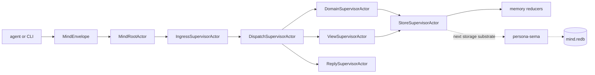
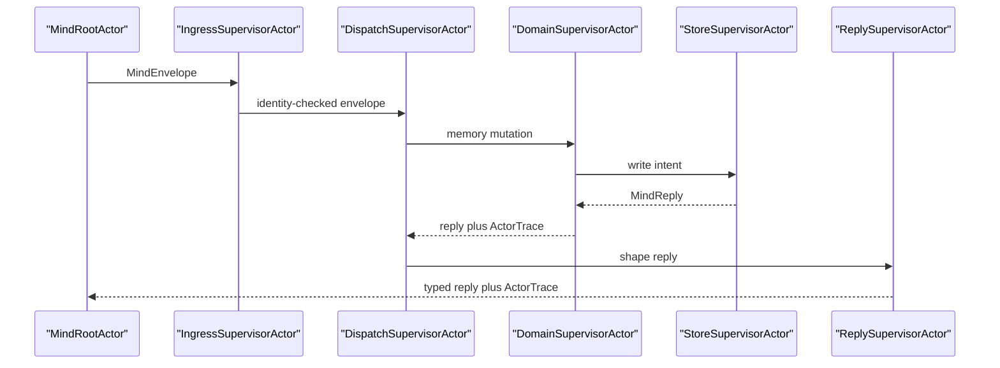

# persona-mind — architecture

*Actor-backed central state machine for Persona coordination and memory.*

> Status: Phase 1 is actor-backed and in-process. The runtime starts a
> `ractor` tree, routes typed `MindEnvelope` requests through named
> supervisor actors, and proves the path with manifest/trace tests. Durable
> `persona-sema` tables are the next storage substrate; current state is still
> held by the in-memory reducers behind `StoreSupervisorActor`.

---

## 0 · TL;DR

`persona-mind` owns Persona's workspace coordination truth: role claims,
handoffs, activity, work/memory items, notes, dependencies, aliases, events,
and ready-work views. It consumes `signal-persona-mind`; it does not own
router delivery, harness lifecycle, terminal adapters, or the sema database
library.

All public operations enter as a typed `MindEnvelope { actor, request }`. The
actor field is infrastructure context supplied before persistence; request
payloads do not mint sender identity. The current runtime is short-lived and
in-process for tests and the future `mind` CLI, but it already uses the same
actor path a long-lived host can reuse.



## 1 · Component Surface

The crate exposes:

- `MindEnvelope` — caller identity plus one `MindRequest`.
- `MindRuntime` — in-process actor runtime facade used by tests and future CLI
  entry.
- `actors::MindRootHandle` — root actor handle; the only bare
  `Actor::spawn` site.
- `actors::ActorManifest` — topology witness naming root, long-lived
  supervisors, and trace-phase actors.
- `actors::ActorTrace` — per-request witness proving which actor planes ran.
- `MemoryState` — current in-memory memory/work reducer owned by
  `StoreSupervisorActor`.
- `ClaimState` — current in-memory claim reducer used by existing claim tests.

The `mind` binary is still a scaffold. It must become a one-NOTA-record input
to one-NOTA-record reply surface over the same `MindRuntime` path; it must not
grow a second command language.

## 2 · Runtime Topology

Phase 1 starts these linked `ractor` actors:

```mermaid
flowchart TB
    root["MindRootActor"]
    root --> config["ConfigActor"]
    root --> ingress["IngressSupervisorActor"]
    root --> dispatch["DispatchSupervisorActor"]
    root --> domain["DomainSupervisorActor"]
    root --> store["StoreSupervisorActor"]
    root --> views["ViewSupervisorActor"]
    root --> subscriptions["SubscriptionSupervisorActor"]
    root --> reply["ReplySupervisorActor"]

    ingress --> request_session["RequestSessionActor trace phase"]
    ingress --> identity["CallerIdentityActor trace phase"]
    ingress --> envelope["EnvelopeActor trace phase"]

    dispatch --> memory_flow["MemoryFlowActor trace phase"]
    dispatch --> query_flow["QueryFlowActor trace phase"]

    domain --> memory_graph["MemoryGraphSupervisorActor trace phase"]
    memory_graph --> item_open["ItemOpenActor trace phase"]
    memory_graph --> note_add["NoteAddActor trace phase"]
    memory_graph --> link["LinkActor trace phase"]
    memory_graph --> status["StatusChangeActor trace phase"]
    memory_graph --> alias["AliasAddActor trace phase"]

    store --> read["SemaReadActor trace phase"]
    store --> writer["SemaWriterActor trace phase"]
    store --> id["IdMintActor trace phase"]
    store --> clock["ClockActor trace phase"]
    store --> append["EventAppendActor trace phase"]
    store --> commit["CommitActor trace phase"]

    views --> ready["ReadyWorkViewActor trace phase"]
    views --> blocked["BlockedWorkViewActor trace phase"]
    views --> recent["RecentActivityViewActor trace phase"]

    reply --> encode["NotaReplyEncodeActor trace phase"]
    reply --> error["ErrorShapeActor trace phase"]
```



The long-lived supervisors are real actors today. The smaller operation planes
are trace-phase actors in Phase 1: they are explicit manifest entries and test
witnesses, and their boundaries are the names that future fine-grained ractor
actors must preserve as persistence lands.

## 3 · Request Paths

Memory mutations run through ingress, dispatch, domain, store, and reply:



Queries run through `ViewSupervisorActor` and `SemaReadActor` trace phases.
The query trace must not include `SemaWriterActor`; `tests/actor_topology.rs`
asserts that ready-work query is read-only by actor path, not by convention.

## 4 · State and Ownership

`StoreSupervisorActor` is the current state owner. It owns `MemoryState`, which
owns a private graph reducer. The reducer appends typed `Event` values for
memory/work mutations and derives item, edge, note, alias, ready, blocked, and
recent-event views from that state.

`MemoryState::dispatch` remains as a reducer test facade. Actor runtime users
call `MindRuntime::submit`, which wraps the same reducer behind the actor
path. `MemoryState::dispatch_envelope` is the bridge that carries envelope
actor identity into event headers and note authorship.

The durable target is one workspace-local `mind.redb`, opened through
`persona-sema`. Only the store/write actor plane is allowed to commit writes.
Queries use read snapshots and return typed views; they do not repair state
while answering.

## 5 · Boundaries

This repo owns:

- role claim and claim-overlap state;
- handoff and activity semantics as they land;
- work/memory graph reducers;
- actor topology, manifest, and traces for mind operations;
- the future `mind` CLI surface.

This repo does not own:

- `signal-persona-mind` contract records;
- `persona-router` delivery;
- `persona-harness` lifecycle;
- terminal or WezTerm state;
- `persona-sema` or `sema` internals;
- BEADS as a live backend.

## 6 · Invariants

- Every public operation enters as one `MindEnvelope`.
- Store-supplied identity, sequence, time, and operation context are
  infrastructure concerns; request payloads carry content, not authority.
- The root actor is the only bare `Actor::spawn` site; children are linked
  from `MindRootActor`.
- No shared `Arc<Mutex<T>>` state exists between actors.
- Queries must not send write intents.
- Every memory/work mutation appends a typed event.
- BEADS is transitional import/history only, never an exclusive lock model.
- Lock files are not durable truth for this crate.

## Code Map

```text
src/lib.rs                 crate surface
src/error.rs               typed Error enum and ractor call flattening
src/envelope.rs            MindEnvelope actor identity wrapper
src/service.rs             MindRuntime in-process actor facade
src/actors/mod.rs          actor module exports
src/actors/root.rs         MindRootActor and MindRootHandle
src/actors/ingress.rs      ingress supervisor and envelope preparation trace
src/actors/dispatch.rs     request classification and flow selection
src/actors/domain.rs       memory mutation domain path
src/actors/store.rs        current state owner; reducer-backed read/write path
src/actors/view.rs         query/read-view path
src/actors/reply.rs        typed reply shaping path
src/actors/config.rs       store-path configuration actor
src/actors/subscription.rs post-commit push actor placeholder
src/actors/manifest.rs     actor topology manifest
src/actors/trace.rs        actor trace witness types
src/claim.rs               claim-scope reducer
src/memory.rs              memory/work graph reducer
src/role.rs                local role value
src/main.rs                scaffold CLI
tests/actor_topology.rs    manifest and actor-path truth tests
tests/memory.rs            memory/work reducer tests
tests/smoke.rs             claim reducer tests
```

## See Also

- `~/primary/reports/operator/101-persona-mind-full-architecture-proposal.md`
  — full actor-heavy target architecture.
- `~/primary/reports/operator/102-actor-heavy-persona-mind-research.md`
  — actor-system research and ractor recommendation.
- `~/primary/reports/designer/100-persona-mind-architecture-proposal.md`
  — concrete ID, envelope, database-path, and table-key decisions.
- `../signal-persona-mind/ARCHITECTURE.md` — request/reply contract.
- `../persona-sema/ARCHITECTURE.md` — typed table layer.
