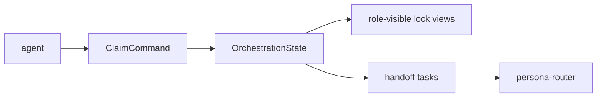

# Persona Orchestrate Architecture

`persona-orchestrate` will replace the ad hoc lock helper with typed state.

The current primary workspace protocol remains the source of truth until this
crate is ready to take over.
