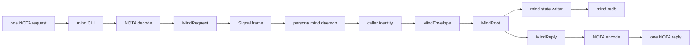
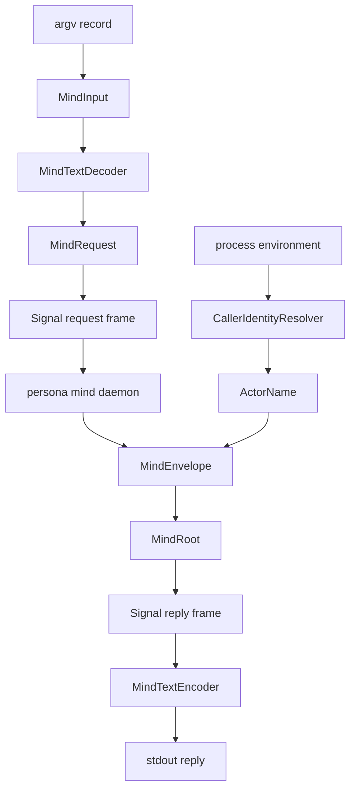
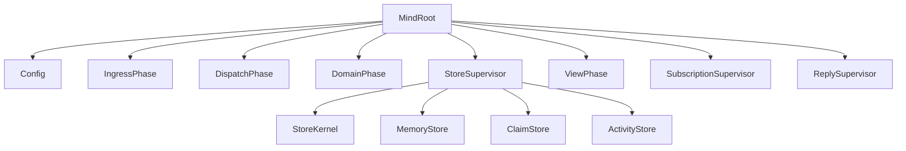
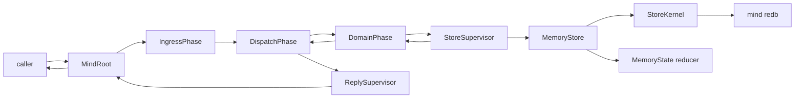
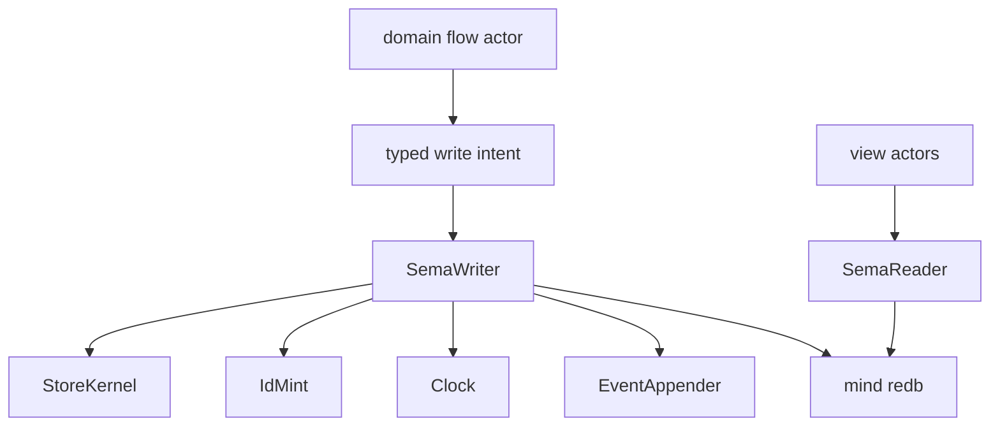
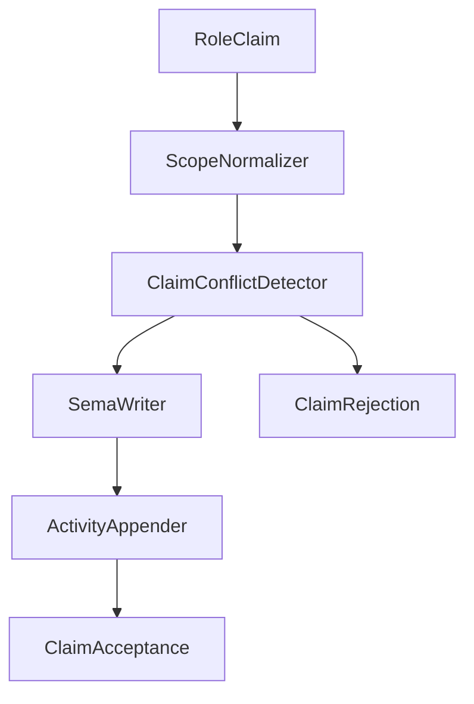
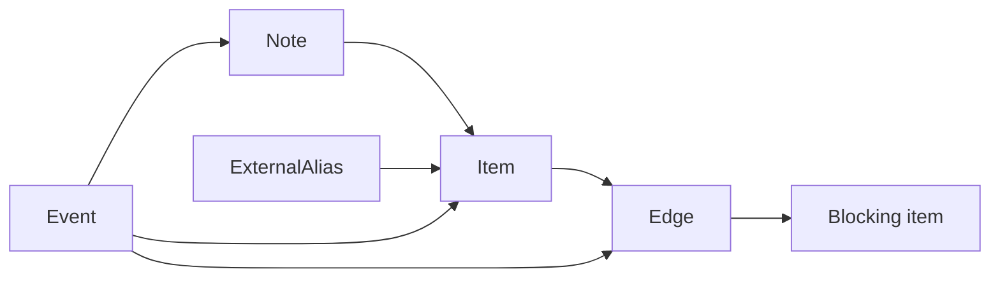

# persona-mind — architecture

*Central Kameo actor system for Persona coordination, work memory, and the
command-line mind.*

> Status: the crate has a real Kameo runtime, mind-local Sema tables for
> durable role claims, activity records, and a typed work-graph snapshot over
> mind-local Sema, plus a Unix-socket Signal-frame daemon/client transport
> around `MindRoot`. The `mind` binary can run a daemon and submit NOTA role
> claim/release/handoff/observation, activity submission/query, and work-graph
> opening/note/link/status/alias/query requests through that daemon.

> **Scope.** "Sema" in this document is today's `sema` library (typed
> storage kernel; rename pending → `sema-db`). The eventual `Sema` is
> broader (universal medium for meaning); today's persona-mind is a
> realization step on the eventually-self-hosting stack, built rightly
> for the scope it serves now. See `~/primary/ESSENCE.md` §"Today and
> eventually — different things, different names".

---

## 0 · TL;DR

`persona-mind` owns Persona's central workspace state: role claims, handoffs,
activity, work items, notes, dependencies, decisions, aliases, event history,
and ready/blocked views. It replaces the lock-file orchestration model. Lock
files are not part of this implementation; they are a temporary workspace
coordination mechanism that will be retired when agents switch to `mind`. BEADS
entries may be imported as history/aliases, but BEADS is not a live backend.

All public operations enter through `signal-persona-mind` records. The
command-line surface is the `mind` binary: exactly one NOTA request record in,
exactly one NOTA reply record out. The binary is a thin client, not a second
command language. It decodes NOTA into `MindRequest`, resolves caller identity,
wraps the request in a Signal frame, sends that frame to a long-lived
`persona-mind` daemon, and prints the daemon's NOTA `MindReply`.

The daemon owns `MindRoot` for its process lifetime. Tests and early
scaffolding use `ActorRef<MindRoot>` directly; there is no separate in-process
runtime facade. Request phases that currently exist as trace witnesses become
real actors when they own state, IO, failure, identity, time, IDs, or
transaction ordering.



## 1 · Public Surface

The crate exposes:

| Surface | Purpose |
|---|---|
| `MindEnvelope` | Infrastructure-supplied caller identity plus one `MindRequest`. |
| `ActorRef<MindRoot>` | Direct Kameo root actor surface for in-process tests and daemon scaffolding. |
| `MindRootReply` | Typed reply plus actor trace witness. |
| `MemoryState` | Current in-memory work/memory reducer used behind the actor path. |
| `ClaimState` | Current in-memory claim reducer used by claim-scope tests. |
| `actors::ActorManifest` | Runtime topology witness. |
| `actors::ActorTrace` | Per-request path witness for architectural-truth tests. |
| `MindDaemonEndpoint` | Unix-socket endpoint value for the local daemon transport. |
| `MindFrameCodec` | Length-prefixed Signal frame codec used by client and daemon. |
| `MindClient` | Thin local client that attaches Signal auth, submits one request frame, and reads one reply frame. |
| `MindDaemon` | Bound one-shot daemon harness around `MindRoot`; reads actor identity from Signal auth before entering the root actor. |
| `MindCommand` | Process-boundary command parser for daemon mode and one NOTA request submission. |
| `MindTextRequest` / `MindTextReply` | Current NOTA projection for role coordination, activity, and work-graph request/reply records. |
| `mind` binary | Daemon-backed command-line mind for the implemented role-state slice. |

The public protocol is not defined here. `signal-persona-mind` owns the
request and reply records. `persona-mind` consumes those records and applies
state transitions.

## 2 · Command-line Mind

The command-line mind is a thin client boundary over a long-lived daemon. The
daemon owns the runtime path. The current crate has a Unix-socket daemon,
Signal-frame transport, and a NOTA projection for role coordination, activity,
and work-graph operations.

Command-line interfaces in this workspace interact with daemons. The
command-line mind is not a one-shot state owner and should not reopen that
decision.



Process-boundary types should be small and data-bearing:

| Type | Owns |
|---|---|
| `MindCommand` | argv, environment, exit rendering. |
| `MindTextRequest` | exactly-one-record rule for implemented request records. |
| `MindTextReply` | NOTA rendering for implemented reply records. |
| `MindClient` | caller identity as Signal auth plus request/reply exchange. |
| `MindDaemonEndpoint` | local daemon endpoint default and explicit override. |

No request payload mints authority. Actor identity, timestamps, event sequence,
operation IDs, and display IDs are infrastructure/store concerns.

## 3 · Runtime Topology

Current long-lived actors:



Current request path for implemented memory/work operations:



`TraceNode` currently names both real Kameo actors and trace phases. The
manifest distinguishes them through residency. That is acceptable as a staging
tool, but stateful phases must graduate into real actors as implementation
lands.

| Trace phase | Graduation trigger |
|---|---|
| `NotaDecoder` | owns text diagnostics and parse failure. |
| `CallerIdentityResolver` | owns caller resolution and authority failure. |
| `ClaimFlow` / `ClaimConflictDetector` | owns conflict semantics. |
| `ActivityFlow` / `ActivityAppender` | owns store-stamped activity append. |
| `SemaWriter` | owns write ordering and transaction failure. |
| `SemaReader` | owns read snapshots. |
| `IdMint` | owns stable/display ID collision state. |
| `Clock` | owns store-supplied time. |
| `EventAppender` | owns append-only event ordering. |

## 4 · State and Storage

Current implementation:

- `StoreSupervisor` supervises `StoreKernel`, `MemoryStore`, `ClaimStore`, and
  `ActivityStore`.
- `StoreKernel` is the only actor that opens and owns the `MindTables` handle
  over `mind.redb`.
- `MindTables` schema v3 owns claims, activities, an activity slot cursor, and
  the typed `memory_graph` snapshot table.
- `ClaimStore` routes claim/release/handoff/observation work to `StoreKernel`,
  where `ClaimLedger` performs the Sema reads and writes.
- `ActivityStore` routes activity append/query work to `StoreKernel`, where
  `ActivityLedger` performs the Sema reads and writes.
- `MemoryStore` owns the private `MemoryState` reducer and commits accepted
  work/memory snapshots through `StoreKernel`.
- Work/memory mutations append typed `Event` values in the reducer, then
  replace the typed Sema graph snapshot before success replies are emitted.
- Queries read the loaded work graph through `MemoryStore` and produce typed
  `View` replies.
- Role claim, release, handoff, observation, activity submission, and activity
  query are routed through the actor path.

Destination:



The durable store is one workspace-local `mind.redb` owned by
`persona-mind`. The storage mechanism is `sema`; the mind-specific Sema layer
and table declarations belong to `persona-mind` because mind owns this state.
There is no shared `persona-sema` layer for mind state. Other components talk
to mind through `signal-persona-mind`.

Recommended tables:

| Table | Purpose |
|---|---|
| `claims` | Active role claims and reasons. |
| `handoffs` | Pending/completed handoff records. |
| `activities` | Store-stamped role activity. |
| `activity_next_slot` | Next activity slot cursor; avoids scanning activities on every append. |
| `memory_graph` | Current typed graph snapshot for the first durable implementation wave. |
| `items` | Work/memory/decision/question records. |
| `notes` | Notes attached to items. |
| `edges` | Dependencies and references. |
| `aliases` | Imported or external identifiers, including BEADS IDs. |
| `events` | Append-only state mutation history. |
| `meta` | schema version and store identity. |

The event log is the audit trail. Current-state tables and views are derived
state optimized for queries.

## 5 · Role Coordination

The first `mind` replacement for `tools/orchestrate` must implement:

| Operation | Required behavior |
|---|---|
| `RoleClaim` | normalize scopes, detect conflicts, commit accepted claims. |
| `RoleRelease` | release all scopes for the role. |
| `RoleHandoff` | verify exact source ownership, verify target compatibility, move ownership atomically. |
| `RoleObservation` | return typed role snapshot plus recent activity. |
| `ActivitySubmission` | append store-stamped activity; caller does not supply time. |
| `ActivityQuery` | read recent activity with typed filters. |



This replaces lock-file ownership. Do not add lock-file projections to
`persona-mind`; migration away from lock files is handled at the workspace
workflow boundary, not inside the mind implementation.

## 6 · Work and Memory Graph

The work graph is the typed replacement for BEADS as an active project memory
substrate. BEADS entries may be imported once as aliases or external
references; Persona should not grow a long-term BEADS bridge.

Implemented reducer requests:

- `Open`
- `AddNote`
- `Link`
- `ChangeStatus`
- `AddAlias`
- `Query`

Required graph invariants:

- Items have stable internal IDs and short display IDs.
- Dependencies are typed edges, not string fields.
- Notes are append-only records attached through events.
- Imported IDs become aliases or external references.
- Ready/blocked views derive from item status and dependency edges.
- Queries do not mutate state.



## 7 · Boundaries

This repo owns:

- the `mind` CLI binary and process-boundary logic;
- Kameo runtime topology for the central mind;
- role claim/release/handoff/activity behavior;
- work/memory graph behavior;
- durable `mind.redb` ownership;
- mind-specific architectural-truth tests.

This repo does not own:

- `signal-persona-mind` contract records;
- router delivery or harness messaging;
- terminal or WezTerm transport;
- OS/window-manager observation;
- `sema` kernel internals;
- a shared database for other components;
- BEADS as a live backend.

## 8 · Constraints

- The `mind` CLI accepts exactly one NOTA request record and prints exactly one
  NOTA reply record.
- The `mind` CLI sends Signal frames to the long-lived `persona-mind` daemon;
  it does not own `MindRoot`.
- The `mind` CLI supports role claim/release/handoff/observation, activity
  submission/query, and work-graph opening/note/link/status/alias/query text
  records.
- `MindClient` sends one length-prefixed Signal request frame to the daemon and
  expects one length-prefixed Signal reply frame back.
- `MindClient` supplies caller identity through Signal auth, not through the
  request payload.
- `MindDaemon` routes request frames through `MindRoot`; it does not construct
  success replies without the actor path.
- `MindDaemon` rejects request frames that do not carry a recognized Signal
  auth proof.
- A missing daemon cannot produce a client reply.
- The daemon owns `MindRoot` for its process lifetime.
- The daemon owns `mind.redb`; the CLI never opens the database.
- `StoreKernel` is the only store actor that opens and owns the `MindTables`
  handle for `mind.redb`.
- `MemoryStore`, `ClaimStore`, and `ActivityStore` do not open separate
  database handles; they ask `StoreKernel`.
- Role claims, releases, handoffs, and observations read/write the mind-local
  Sema claims table in `mind.redb`.
- Activity submissions and queries read/write the mind-local Sema activities
  table in `mind.redb`.
- Work/memory writes replace the typed `memory_graph` snapshot in `mind.redb`
  before producing success replies.
- `MindRequest` and `MindReply` come from `signal-persona-mind`; the CLI does
  not define a parallel command vocabulary.
- All public state operations enter the actor system as one `MindEnvelope`.
- Caller identity, time, event sequence, operation IDs, stable IDs, and display
  IDs are minted by infrastructure/store actors, not by request payloads.
- The root actor is the only bare Kameo spawn site.
- Stateful/failure-bearing phases are actors or reducers owned by actors, not
  shared locks between actors.
- Queries never send write intents.
- Writes append typed events before producing success replies.
- Role claim, release, handoff, and observation are successful runtime paths,
  not unsupported placeholders.
- BEADS import creates aliases or external references only; there is no live
  BEADS bridge.
- Lock files are outside the implementation; `persona-mind` replaces them
  instead of projecting them.

## 9 · Invariants

- Every public state operation enters as one `MindEnvelope`.
- The command-line surface accepts one NOTA request record and prints one NOTA
  reply record.
- `MindRequest` and `MindReply` come from `signal-persona-mind`; the CLI does
  not define a parallel command vocabulary.
- Actor identity, time, event sequence, operation IDs, and display IDs are
  minted by infrastructure/store actors, not by request payloads.
- The root actor is the only bare Kameo spawn site.
- State-bearing phases are actors or reducers owned by actors; no shared
  `Arc<Mutex<T>>` crosses actor boundaries.
- The memory reducer is owned as mutable actor state, not hidden behind
  `RefCell`.
- Queries never send write intents.
- Writes append typed events.
- Durable truth lives in `mind.redb`; lock files are outside this
  implementation and BEADS is import/history only.

## 10 · Architectural-truth Tests

The next implementation wave should add tests named for architectural
constraints:

| Test | Proves |
|---|---|
| `mind_cli_accepts_one_nota_record_and_prints_one_nota_reply` | command surface shape. |
| `mind_cli_uses_signal_persona_mind_types` | no duplicate CLI request enum. |
| `mind_cli_sends_nota_role_claim_to_daemon` | CLI text enters the daemon path, not an in-process shortcut. |
| `mind_cli_reads_role_observation_without_lock_files` | observation comes from mind state, not lock-file projection. |
| `mind_cli_opens_and_queries_work_item_through_daemon` | work-graph text crosses the daemon path and returns typed NOTA replies. |
| `mind_cli_mutates_work_item_through_daemon` | note/link/status/alias work-graph mutations cross the daemon path and return typed NOTA receipts. |
| `role_claim_reaches_claim_flow_and_commits` | claim requests are not routed to unsupported. |
| `conflicting_claim_returns_typed_rejection` | conflicts are data. |
| `role_observation_reads_claims_without_writer` | role observation is a read path. |
| `role_release_removes_claims_from_observation` | release mutates role state. |
| `role_handoff_moves_claim_between_roles` | handoff moves exact source claims to the target role. |
| `handoff_without_source_claim_returns_typed_rejection` | handoff failure is typed, not an unsupported placeholder. |
| `activity_submission_reaches_activity_flow_and_store_mints_time` | activity append goes through activity flow and store-minted time. |
| `activity_query_reads_recent_activity_without_writer` | activity query is a read path with filters. |
| `role_observation_includes_recent_activity` | role observation includes the recent activity projection. |
| `mind_tables_open_stays_inside_the_store_actor_boundary` | `mind.redb` is opened only at the store actor boundary. |
| `memory_state_cannot_hide_mutation_behind_refcell` | memory mutation is actor-owned mutable state, not interior mutability. |
| `query_ready_uses_reader_without_writer` | read path cannot mutate state. |
| `daemon_round_trip_uses_signal_frames_over_socket` | one socket request/reply crosses the Signal-frame transport and reaches `MindRoot`. |
| `daemon_uses_signal_auth_for_actor_identity` | caller identity is derived from Signal auth before building `MindEnvelope`. |
| `daemon_rejects_request_frames_without_auth` | daemon cannot accept unauthenticated request frames. |
| `client_cannot_reply_without_daemon_signal_frame` | clients cannot fabricate successful daemon replies. |
| `mind_store_survives_process_restart` | role claims committed by one daemon process are visible after a daemon restart on the same `mind.redb`. |
| `mind_memory_graph_survives_process_restart` | work items opened by one daemon process are visible after a daemon restart on the same `mind.redb`. |
| `mind_runs_without_lock_file_projection` | lock files are outside the implementation. |
| `beads_import_creates_alias_only` | no live BEADS bridge. |

## Code Map

```text
src/lib.rs                 crate surface
src/command.rs             daemon/client command-line boundary
src/error.rs               typed Error enum and actor call errors
src/envelope.rs            MindEnvelope actor identity wrapper
src/actors/mod.rs          actor module exports
src/actors/root.rs         MindRoot
src/actors/ingress.rs      ingress supervisor and envelope preparation trace
src/actors/dispatch.rs     request classification and flow selection
src/actors/domain.rs       memory mutation domain path
src/actors/store.rs        store supervisor, store kernel, and narrow store actors
src/actors/view.rs         query/read-view path
src/actors/reply.rs        typed reply shaping path
src/actors/config.rs       store-path configuration actor
src/actors/subscription.rs post-commit push actor placeholder
src/actors/manifest.rs     actor topology manifest
src/actors/trace.rs        actor trace witness types
src/activity.rs            activity append/query ledger over mind-local Sema
src/claim.rs               claim-scope reducer
src/memory.rs              memory/work graph reducer
src/role.rs                local role value
src/tables.rs              mind-local Sema schema and role/activity tables
src/text.rs                NOTA role-state projection for mind CLI
src/transport.rs           Unix-socket Signal-frame client/daemon transport
src/main.rs                command-line entry point
tests/actor_topology.rs    manifest and actor-path truth tests
tests/weird_actor_truth.rs static actor-discipline and weird runtime tests
tests/daemon_wire.rs       Signal-frame daemon/client socket tests
tests/cli.rs               daemon-backed mind CLI tests
tests/memory.rs            memory/work reducer tests
tests/smoke.rs             claim reducer tests
```

## See Also

- `~/primary/reports/operator/101-persona-mind-full-architecture-proposal.md`
- `~/primary/reports/operator/105-command-line-mind-architecture-survey.md`
- `~/primary/reports/designer/100-persona-mind-architecture-proposal.md`
- `~/primary/reports/designer/106-actor-discipline-status-and-questions.md`
- `../signal-persona-mind/ARCHITECTURE.md`
