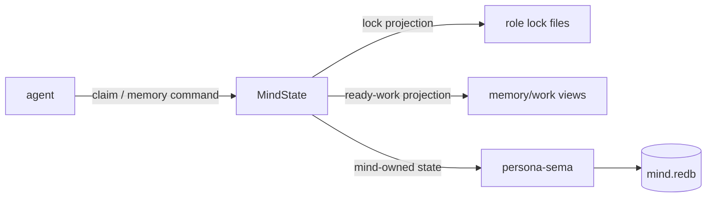

# persona-mind — architecture

*Central state machine for agents working in the Persona ecosystem.*

`persona-mind` is Persona's heart: the typed state machine for roles,
claims, handoffs, activity, memory/work items, notes, dependencies,
decisions, aliases, and ready-work views. It is the typed successor to
`~/primary/tools/orchestrate` and the replacement for the transitional
BEADS task substrate.

---

## 0 · TL;DR

This repo owns the central state of Persona. It is not the runtime router,
harness delivery engine, terminal adapter, or database library.



## 1 · Component Surface

`persona-mind` exposes:

- a **library crate** (`persona-mind`) that consumes
  the `signal-persona-mind` contract, opens
  `mind.redb` through `persona-sema`, and dispatches
  typed requests to handlers;
- a **binary crate** (`mind`) — the canonical CLI agents
  invoke per call; takes one Nota record on argv (per
  `lojix-cli`'s discipline), prints one Nota record on
  stdout;
- typed `sema::Table<K, V>` constants for the runtime
  state (`CLAIMS`, `ACTIVITIES`, `ITEMS`, `EVENTS`,
  `EDGES`, `NOTES`, `ALIASES`, `META`);
- claim/release/handoff handlers with overlap detection;
- the activity log: `ActivitySubmission` writers,
  `ActivityQuery` readers;
- memory/work graph handlers: open item, add note, link,
  status change, alias, and query;
- lock-file projection writers (regenerate `<role>.lock`
  files on every claim/release/handoff for backward
  compatibility);
- the `RoleObservation` snapshot builder.

Channel: `signal-persona-mind` (request/reply,
role, activity, and memory/work request kinds; see that crate's
`ARCHITECTURE.md`).

The current direction is grounded by
`~/primary/reports/operator/100-persona-mind-central-rename-plan.md`.

## 2 · State and Ownership

This component owns central mind state — roles, claims, handoff tasks,
activity, memory/work items, notes, edges, aliases, lock projections, and
ready-work views. The state lives in this component's **own redb file**
(`mind.redb`), opened through `persona-sema` (which uses the workspace's
`sema` database library underneath). Lock files on disk are projections of
the typed records, regenerated from the database on commit.

While primary still uses plain lock files (`tools/orchestrate`), this repo
models the typed replacement. BEADS remains transitional and is never modeled
as an exclusive lock. Existing BEADS entries can be imported once as mind
events and aliases; there is no long-term bridge.

Per `~/primary/reports/designer/92-sema-as-database-library-architecture-revamp.md`:
sema is a library; this component owns its own sema-managed database, the
same way every other state-bearing component does (criome, persona-router,
persona-harness, future mentci).

## 3 · Boundaries

This repo owns:

- agent role and claim state;
- claim/release command surfaces;
- workspace handoff tasks;
- activity log;
- memory/work graph records, events, and projections;
- dependency-aware ready-work queries;
- projections compatible with the current orchestration protocol.

This repo does not own:

- runtime Persona delivery (`persona-router`);
- harness lifecycle (`persona-harness`);
- typed table mechanics (`persona-sema` for table layouts; `sema`
  for the kernel underneath);
- BEADS internals or BEADS exclusivity;
- message delivery state (`persona-router`).

## 4 · Invariants

- Every agent knows its role before claiming.
- Claims prevent overlapping file ownership; BEADS is never claimed.
- Lock files are projections, not the source of durable typed truth.
- Open task checks are coordination visibility, not locking.
- The `mind` CLI takes **one Nota record on argv** (lojix-cli
  discipline). No flags, no subcommands, no env-var dispatch.
  New behavior lands as a typed positional field on
  `MindRequest`, never as a flag.
- Every memory/work mutation appends a typed `Event`; current
  item state is a projection, never silent mutation.
- `Activity::stamped_at` is **store-supplied** at commit
  time, never agent-supplied (per ESSENCE
  infrastructure-mints rule).
- Subscriptions emit only **after** redb commit completes
  (per assistant/90 §"Emit After Commit"; v1 has no
  subscriptions yet — request/reply only).
- Concurrent CLI invocations serialize cleanly through
  redb's MVCC; multiple readers run in parallel.

## 5 · Runtime tables

| Table | Key | Value | Purpose |
|---|---|---|---|
| `CLAIMS` | `(RoleName, ScopeReference)` byte-encoded | `ClaimEntry` | Active claims, one row per (role, scope) pair |
| `ACTIVITIES` | `u64` (slot) | `Activity` | Append-only activity log |
| `EVENTS` | `EventSeq` | `Event` | Append-only mind memory log |
| `ITEMS` | `StableItemId` | `Item` | Current item projection |
| `EDGES` | `EventSeq` | `Edge` | Typed dependency/reference graph |
| `NOTES` | `EventSeq` | `Note` | Append-only notes |
| `ALIASES` | `ExternalAlias` | `StableItemId` | Imported identity and shorthand lookup |
| `META` | `&str` | `u64` | Slot counter for activities; future schema-version meta |

Composite keys are byte-encoded with explicit ordering
(per `~/primary/reports/assistant/90-rkyv-redb-design-research.md`
§"Do Not Store Arbitrary rkyv Archives as redb Keys" — keys
are designed, not rkyv-encoded).

## Code Map

```text
src/lib.rs            module entry; library surface
src/error.rs          typed Error enum (thiserror)
src/state.rs          MindState handle (opens mind.redb)
src/tables.rs         typed sema::Table<K, V> constants
src/claim.rs          RoleClaim / Release / Handoff handlers
src/observation.rs    RoleObservation handler (build snapshot)
src/activity.rs       ActivitySubmission / ActivityQuery handlers
src/memory.rs         item / note / edge / alias / query handlers
src/projection.rs     lock-file projection writer
src/service.rs        frame dispatch (request → handler → reply)
src/main.rs           mind CLI entry: parse Nota argv, dispatch, print Nota reply
tests/claim_release_handoff.rs
tests/activity_log.rs
tests/memory_graph.rs
tests/lock_projection.rs
```

## See Also

- `~/primary/reports/operator/100-persona-mind-central-rename-plan.md`
  — current central-component rename and fold-in plan.
- `~/primary/protocols/orchestration.md` — the current
  protocol; updated post-Rust-impl.
- `../signal-persona-mind/ARCHITECTURE.md` — the
  contract this component consumes.
- `../persona-sema/ARCHITECTURE.md` — typed table layer.
- `../persona/ARCHITECTURE.md` — apex.
- `~/primary/reports/assistant/90-rkyv-redb-design-research.md`
  — production sema-interface research informing table
  design.
